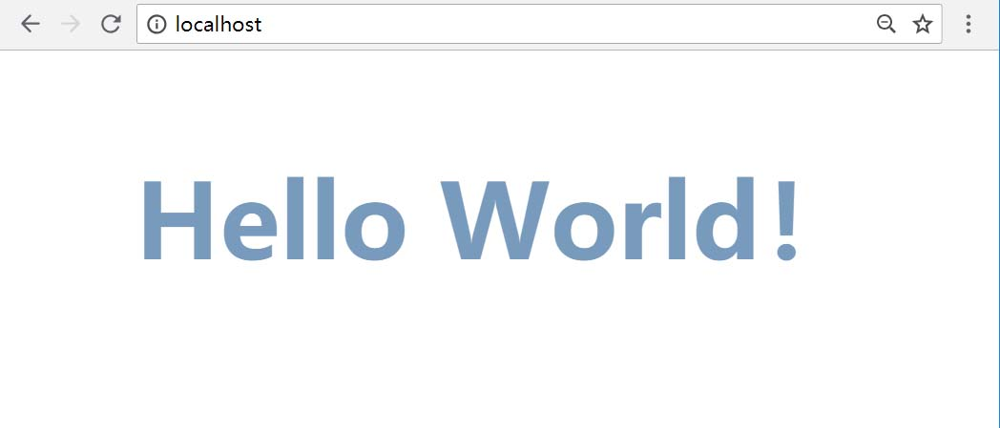
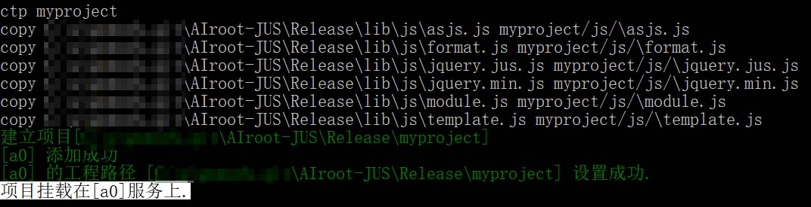
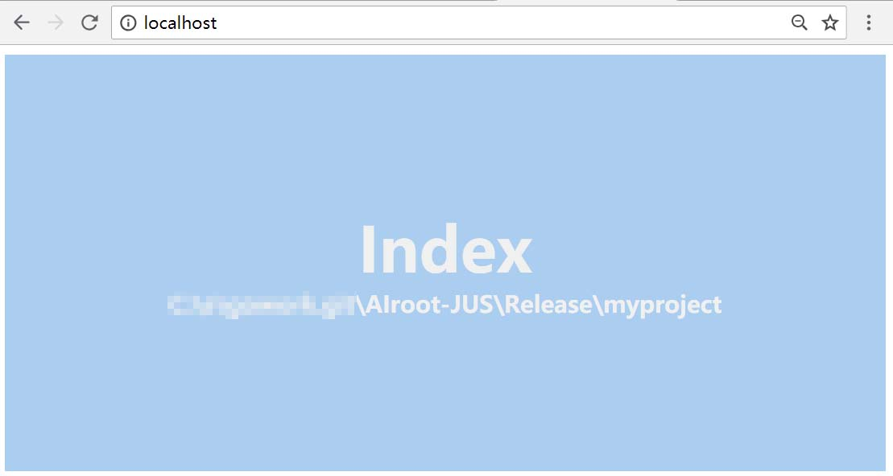

# AIroot-JUS
[http://www.airoot.cn/](http://www.airoot.cn/)
<table>
    <tr>
        <td></td>
        <td valign='top'>
            <h2>支持自定义HTML标签</h2>
可以自己动手编写一个标签，完全由你定义， 支持使用HTML、CSS、JavaScript混合编写。
        </td>
    </tr>
    <tr>
        <td></td>
        <td valign='top'>
           <h2>支持HTML封装为控件</h2>
HTML页就是控件(模块页)，你可以发布这个模块到任何人的Super HTML平台上使用。
        </td>
    </tr>
    <tr>
        <td></td>
        <td valign='top'>
           <h2>支持复杂的游戏编程</h2>
它是一个更高级的编译平台，结构和语法更加稳健。
        </td>
    </tr>
    <tr>
        <td></td>
        <td valign='top'>
           <h2>快速响应布局</h2>
平台默认提供一套布局框架，它让你在页面开发上事半功倍。
        </td>
    </tr>
    <tr>
        <td></td>
        <td valign='top'>
            <h2>支持高级Script语法糖</h2>
支持更好的面向对象特性，同时兼容JavaScript的写法。
        </td>
    </tr>
    <tr>
        <td></td>
        <td valign='top'>
            <h2>支持继承和扩展</h2>
支持继承HTML页，同时可以对HTML页元素扩展。 支持public、private、static等关键字。
        </td>
    </tr>
    <tr>
        <td></td>
        <td valign='top'>
            <h2>自动生成API文档</h2>
完成一个HTML模块页，平台会自动生成模块的API说明文档。不用人工干涉。
        </td>
    </tr>
</table>
 

## 前端渲染平台
JUS (代号), 是一款编译系统,可以将WEB页封装和发布。它不是JS框架、也不是DOM框架。
其内建的编译引擎可以升级当前WEB平台，使它具备面向对象的特性。
JUS的优势是抛开了以往语言级别的面向对象设计，采用全面向对象设计（包含HTML、CSS、JavaScript等）。
JUS的开发和普通的WEB开发没有什么区别，几乎零学习成本。
## 与Node.js区别
首先，JUS不负责后台开发，也就是说它只面向前端开发，你不可以把它作为动态服务器来学习。
### 优势
JUS 不需要安装、即学即用。程序体积小，在性能及易用性上都做了深度考量。    
JUS 即面向普通WEB开发，同时也面向模块化开发。   
JUS 即适合初学者人群，同时也适合高级JavaScript开发人群。

## 面向对象能力与 React、Vue 对比
目前互联网解决模块化方案，主要是国外的React和国内的Vue框架，这两个框架的模块化开发主要基于Webpack.js,并且React提供了完善的服务端渲染能力。两者从对比讲React提供了完善的编程方案，而Vue提供了更友好的开发体验。对于我而言，我更喜欢React的编程方案（JSX）,而Vue虽然也很不错，但是在预研操控性上感觉比较暗淡，举一个不恰当的例子，他们的对比就像Unix和window的体验。
React和Vue均使用了Virtual DOM技术，传说可以更快，但是这仅仅是特定场景下的对比，真实来讲DOM的操作效率还是原生的更好，因为没有谁会频繁大量的操作的DOM，像这种高负荷场景，一般都会选择虚拟化视图、canvas 2D和 webgl来解决。

对于React和Vue的生态圈，React的最大，Vue也在成长，但是相比以往非Virtual DOM的库，其资源是远远大于React和Vue的总和，这是毋庸置疑的，因为在没有推出模块化框架之前，Web的开发已经做得很好了。

AIroot-JUS 相比现在的WEB 模块化框架,其在设计之初就是以模块化思想为基础，AIroot-JUS 的开发体验更加友好，拥有高效的编程方案，同时兼备了友好的开发体验。
JUS 在设计之初，就将模块化、资源管理、整合其他框架作为其创建目标，所以你会发现，当你开启JUS编程第一个Hello World的页面时，其背后已经帮你解决了许多关键问题。不需要什么全家桶、不需要什么机制，加载、渲染、卸载、资源管理、网络资源、外部包等等，都已经考虑了。

## AIroot-JUS 是重量级框架吗？
首先，AIroot-JUS 不是框架，他是一个面向前端的渲染平台，采用Google Golang 开发。JUS的默认发布框架包仅仅只有20KB。JUS的设计初衷就是用最简单的代码解决复杂的问题，平台发布代码均以高扩展性、高复用性、高维护性作为思想基础，你可以想象到，一套轻量级的代码量去构建重量级别的项目。  
因此，JUS是轻量级的平台，但是可以承接复杂的项目。JUS发布的项目是轻量级的，但是具备重量级项目的表现力。

# 搭建环境
下载本站项目，运行Release目录下的main.exe程序。

添加服务节点和项目目录,我们选择Release/example/下的项目,并运行在80端口：
```cmd
    add a0 example/HelloWorld :80
```
然后打开Chrome/FireFox/Edge浏览器，输入http://localhost/


# 创建第一个工程
在main.exe程序直接输入 ctp myproject,这里会在main.exe同级创建一个工程目录：
```cmd
ctp myproject
```
运行效果：

然后继续输入 run a0 :80
```cmd
run a0 :80
```
打开浏览器，输入 http://localhost/

## Hello World
```html
<!--
    Hello World
    保存到code/Hello.html
 -->
<style>
    body{
        cursor:pointer;
        text-align:center;
        color:#789abc;
        font-size:90px;
        font-weight:bold;
        padding-top:10%;
    }
</style>
<div>
    Hello World！
</div>
<script>
    function init(){
        dom.addEventListener("click",function(){
            alert("Hello World!");
        });
    }
</script>
```
看到了，在JUS平台写程序这又这些，复杂吗？从外表看来他就是一个HTML页面，但是它是一个模块，一个Module Page。

```html
<!--
    Index
    保存到code/Index.html
 -->
<div>
    <Hello />
</div>
```
好了，我们的模块生效了。
